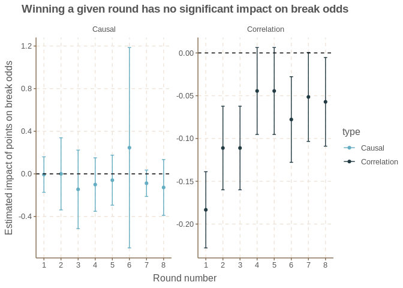
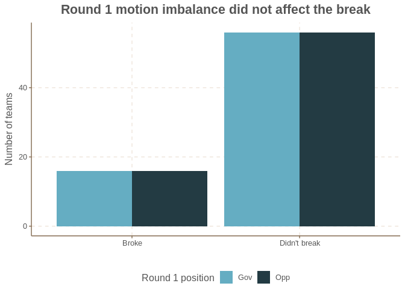
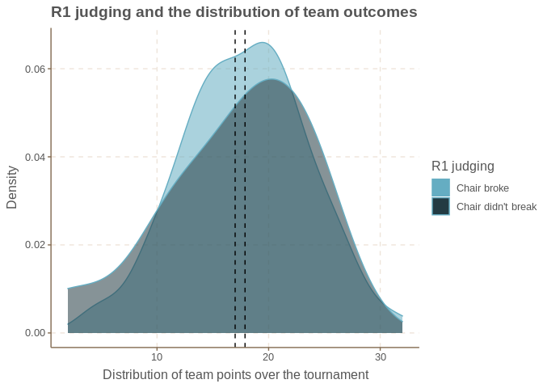

HWS USUDC introduced tapered scoring this year, and HWS NAUDC 2021 wants
to introduce it as well. Many people are skeptical about tapered
scoring, but now that it’s been implemented once we can actually analyze
its effects.

This exercise is inspired by [Emma Pierson’s
analysis](http://obsessionwithregression.blogspot.com/2016/08/how-much-does-losing-first-round-of.html)
of the same flavor. She looks at a typical large debate tournament like
WUDC or EUDC to see whether a team’s round 1 results causally impact
their later-round performance. This question is obviously relevant to
the tapered scoring debate: a large part of the original argument for
tapered scoring is that winning round 1 actually *hurts* teams, who end
up losing in tough rooms, relative to teams that lost round 1 and
submarined their way through easier rounds to a break.

Methodology
===========

Both my and Emma Pierson’s analysis are examples of *instrumental
variables* estimation. The basic idea of IV is simple. We would like to
simply correlate our outcome Y (later round performance/breaking) with a
variables X (performance in early rounds). The problem with a naive
correlation (in a regression, for example) is that X is endogenous. As
Pierson explains:

> In the three debate world championships from 2013 - 2015, teams who
> earned three points in their first round ended up with about six more
> points by the end of the tournament than teams who earned zero points
> in their first round. This seems pretty amazing, because you only get
> three points from winning your first round, and then you have to face
> better teams; how do you end up six points better? Perhaps winning
> your first round gives you a confidence boost that improves your
> performance?
>
> This reasoning is wrong. Winning your first round doesn’t necessarily
> cause you to do better in later rounds; it’s just a sign you’re a
> better team. (Similarly, getting in an ambulance doesn’t cause you to
> die; it’s just a sign that you’re sick.) The teams who win their first
> rounds would’ve done better whether they won their first rounds or
> not.

Therefore, we need a third factor Z which can proxy for X, but isn’t
endogenously determined. This is called an instrument. My instrument is
simple: I use a team’s random assignment to a position to predict
whether they will win. For example, round 1 (THW abolish all zoning
ordinances in the US) was heavily opp skewed, so being an opposition
team predicts winning at a much higher rate than being a gov team, even
though opp and gov teams were probably equally strong. This Z is
strongly correlated with our X (i.e. it has a *strong first stage*) and
it is randomly determined, which allows us to get a true causal estimate
of performance in a round on other rounds.

Technical details
-----------------

IV requires two conditions be met for the estimation to get a reliable
causal inference.

1.  A *strong first stage*: the instrument (average points for a team’s
    position in a round) must be strongly correlated with the endogenous
    variable (team points in that round).
2.  The *exclusion restriction*: the instrument must not affect the
    outcome (the break) through any channel except the endogenous
    variable.

In this setting, the motion in a given round has to be imbalanced for
the first stage to be strong. This is not just side imbalance, as we
normally understand it, but whether all four teams have balanced points.
This means the instrument is usually strong because small imbalances
amplify each other in the statistical comparison. For example, round 2
(THW convert marriages into renewable contracts) has a tiny gov skew
(1.54 points) and a moderate opening skew (1.65 points) but a large
Opening Government skew (1.75 points), which makes it a strong
instrument.

The exclusion restriction is likely satisfied because position
assignment is random. The only wrinkle in this is that position
assignment in each round is not *actually* random: it depends on your
position assignment for previous rounds. However, since every team gets
every position twice (8 rounds, 4 positions) this is unlikely to cause
an issue. That said, the exclusion restriction is untestable and you can
decide whether you find it credible in this situation.

Observation 1: Each round had no individual impact on the break
===============================================================

The most important result of my analysis is summarized in the following
picture:

``` r
# IV break probabilities against winning each round
break_df <- data.frame(round = integer(), estimate = double(), se = double(), weak_pval = double(),
                       type = character())
results <- results %>%
  group_by(round, position) %>%
  mutate(pos_rank_round = mean(rank)) %>% ungroup()

round_impact <- function(r) {
  iv <- ivreg(broke ~ rank | pos_rank_round, data = filter(results, round == r))
  ols <- lm(broke ~ rank, data = filter(results, round == r))
  s_iv <- summary(iv, vcov = sandwich, diagnostics = T)
  s_ols <- summary(ols, vcov = sandwich)
  row_iv <- data.frame(round = r, estimate = s_iv$coefficients[2,1], se = s_iv$coefficients[2,2],
                    weak_pval = s_iv$diagnostics[1,4], type = "Causal")
  row_ols <- data.frame(round = r, estimate = s_ols$coefficients[2,1], se = s_ols$coefficients[2,2],
                        weak_pval = NA, type = "Correlation")
  break_df <<- bind_rows(break_df, row_iv, row_ols)
}

x <- sapply(1:8, round_impact)

# graph with the standard errors
ggplot(break_df, aes(x = round, y = estimate, color = type)) +
  geom_point() +
  geom_errorbar(aes(ymin = estimate- 1.64*se, ymax = estimate+ 1.64*se), width = 0.2) +
  scale_x_continuous(breaks = 1:8) +
  geom_hline(yintercept = 0, color = 'black', linetype = 'dashed') +
  facet_wrap(~type, scales = "free") +
  labs(x = "Round number", y = "Estimated impact of points on break odds",
       title = "Winning a given round has no significant impact on break odds") +
  theme(plot.title = element_text(hjust = 0.5, size = 16))
```



Here, we are estimating the effect of *rank* in a round rather than
points, to avoid underweighting the effect of early rounds (which have
more points, so the marginal impact of a rank is 3x higher than the
marginal impact of a point). Negative results mean that a higher
numerical rank - a worse rank - is associated with a worse break
outcome.

On the right, we can see that the correlational impact is shocking in
magnitude. Dropping a rank in round 1 is associated with an 18% lower
probability of breaking - that means getting a 4 instead of a 1 is
associated with a 54% lower probability of breaking! Rounds 2 and 3 are
similarly blown up. This sounds terrifying, but it’s wrong. Teams that
win round 1 have a higher probability of breaking because they are
better on average than teams who lose round 1. That’s why the
correlation approach is not reliable.

The left-side causal estimates are much more reliable, and they confirm
a major argument for tapered scoring: it equalizes the impact of
different rounds on the break. If this were true, we would expect to see
that the causal impact of a single round on the break is close to zero.
This claim seems decisively true. Each round has no statistically
significant effect on a team’s probability of breaking.

(Technical readers might wonder whether my instrument is reliable for
each regression, since I use motion imbalance, and many rounds may have
balanced motions. The first stage is strong (F \> 10) for all rounds
except round 6, which was pretty balanced; this weakness shows in R6’s
large error bars.)

One particularly strong illustration of this null effect comes from
round 1. Even though R1 was highly imbalanced (1.83 points to opp), and
R1 was weighted the highest of all rounds (9 points to winners), the
break had exactly 16 teams who opped R1 and 16 teams who goved R1.

``` r
results %>%
  filter(round == 1) %>%
  mutate(broke = ifelse(broke, "Broke", "Didn't break"),
         position = ifelse(grepl("Opposition", position), "Opp", "Gov")) %>%
  ggplot(aes(x = broke, fill = position)) +
  geom_bar(position = "dodge") +
  labs(x = "", y = "Number of teams",
       title = "Round 1 motion imbalance did not affect the break",
       fill = "Round 1 position") +
  theme(plot.title = element_text(hjust = 0.5, size = 16),
        legend.position = "bottom")
```



The impact of this null result is pretty significant. To people who
objected to tapered scoring because it would make round 1 results
destiny - e.g. losing early rounds could knock you out of the break -
this constitutes pretty definitive evidence against that. It should also
be a massive relief to teams who were anxious about their round 1
results, and feared that a 4 in round 1 would knock them out of the
break permanently. I know that my biggest worry about tapered scoring
has been that it is just incredibly stressful because of the fear of
going through seven rounds knowing that you have no chance. It turns out
that just isn’t true, that your round 1 results have no more impact on
your break chances than any other round. Sometimes, teams get
demotivated and don’t try to improve if they lose an early round: this
should prove to those teams that they actually don’t have to become
demotivated because of an early loss, and that they still have good
break chances.

Of course, this may not be ideal. Some opponents of tapered scoring
argue that later rounds *should* have a larger impact on the break,
either because it pushes teams to improve over the tournament, or
because of potentially higher judging quality in bubble rounds. That’s a
separate question, one that data can’t help answer.

Observation 2: Round 1 judge variance did not affect the break
==============================================================

The objection to tapered scoring that I heard the most was that round 1
judging was very noisy and shouldn’t affect the break
disproportionately. If the noisy-judging hypothesis is true, then two
suboptimal things could happen to teams judged by weak judges in round
1:

1.  Strong teams are given inaccurate losses.
2.  Weak teams are given inaccurate wins.

If these effects are really distorting the break, then round 1 judge
quality should predict the *consistency* of a team’s results. The teams
who got wins from strong judges in round 1 should be more likely to win
round 2, compared to the teams who got wins from weak judges in round 1.
If this isn’t the case, then “weak” and “strong” judges are giving wins
to the same “quality” of team, and so that can’t cause any break
distortion.

I don’t need any instrumental variables to analyze this, because round 1
judge assignment is random, unlike round 1 scores. So I compare teams
who were judged in round 1 by a chair who eventually broke, to teams who
were judged by a non-breaking chair in round 1.

``` r
# did r1 judging push up teams who lost later?

judge_r1 <- results %>%
  filter(round == 1) %>%
  pivot_wider(id_cols = "chair", names_from = "position", values_from = "team")
colnames(judge_r1)[2:5] <- c("og", "co", "cg", "oo")

s <- results %>%
  group_by(team) %>% mutate(tot_points = sum(points)) %>% ungroup() %>%
  filter(round == 1) %>%
  left_join(judge_r1) %>%
  group_by(chair_broke) %>%
  mutate(chair_broke = ifelse(chair_broke == 0, "Chair didn't break", "Chair broke"))

s %>%
  mutate(mean_points = mean(tot_points)) %>%
  ggplot(aes(x = tot_points, fill = chair_broke, alpha = 0.5)) + geom_density() +
  geom_vline(aes(xintercept = mean_points), color = 'black', linetype = 'dashed') +
  labs(x = "Distribution of team points over the tournament", y = "Density",
       title = "R1 judging and the distribution of team outcomes") +
  guides(fill=guide_legend("R1 judging"), alpha = F)
```



Breaking and non-breaking chairs have a very similar distribution of
outcomes for the teams they judged; but if the noisy-judging hypothesis
were true, we would expect non-breaking chairs to have a more compressed
distribution (they push up bad teams who later sink down, and pull down
good teams who later rise up). Instead, a test of distributions fails to
reject the null (*p* = 0.98) that these distributions are different at
all.

``` r
b <- s %>% filter(chair_broke == "Chair broke") %>% pull(tot_points)
nb <- s %>% filter(chair_broke == "Chair didn't break") %>% pull(tot_points)
test <- ks.test(b, nb, tot_points ~ chair, s) %>% broom::tidy()
test %>% select(-alternative) %>% gt() %>% cols_align("center") %>% tab_header("") %>%
  tab_style(style = cell_text(weight = "bold"), location = cells_body(columns = vars(p.value))) %>%
  tab_header("R1 chair quality variation doesn't create different outcomes for teams") %>%
  tab_source_note("Chair quality proxied by breaking.")
```

<!--html_preserve-->
<style>html {
  font-family: -apple-system, BlinkMacSystemFont, 'Segoe UI', Roboto, Oxygen, Ubuntu, Cantarell, 'Helvetica Neue', 'Fira Sans', 'Droid Sans', Arial, sans-serif;
}

#azmhqvmnhn .gt_table {
  display: table;
  border-collapse: collapse;
  margin-left: auto;
  margin-right: auto;
  color: #333333;
  font-size: 16px;
  font-weight: normal;
  font-style: normal;
  background-color: #FFFFFF;
  width: auto;
  border-top-style: solid;
  border-top-width: 2px;
  border-top-color: #A8A8A8;
  border-right-style: none;
  border-right-width: 2px;
  border-right-color: #D3D3D3;
  border-bottom-style: solid;
  border-bottom-width: 2px;
  border-bottom-color: #A8A8A8;
  border-left-style: none;
  border-left-width: 2px;
  border-left-color: #D3D3D3;
}

#azmhqvmnhn .gt_heading {
  background-color: #FFFFFF;
  text-align: center;
  border-bottom-color: #FFFFFF;
  border-left-style: none;
  border-left-width: 1px;
  border-left-color: #D3D3D3;
  border-right-style: none;
  border-right-width: 1px;
  border-right-color: #D3D3D3;
}

#azmhqvmnhn .gt_title {
  color: #333333;
  font-size: 125%;
  font-weight: initial;
  padding-top: 4px;
  padding-bottom: 4px;
  border-bottom-color: #FFFFFF;
  border-bottom-width: 0;
}

#azmhqvmnhn .gt_subtitle {
  color: #333333;
  font-size: 85%;
  font-weight: initial;
  padding-top: 0;
  padding-bottom: 4px;
  border-top-color: #FFFFFF;
  border-top-width: 0;
}

#azmhqvmnhn .gt_bottom_border {
  border-bottom-style: solid;
  border-bottom-width: 2px;
  border-bottom-color: #D3D3D3;
}

#azmhqvmnhn .gt_col_headings {
  border-top-style: solid;
  border-top-width: 2px;
  border-top-color: #D3D3D3;
  border-bottom-style: solid;
  border-bottom-width: 2px;
  border-bottom-color: #D3D3D3;
  border-left-style: none;
  border-left-width: 1px;
  border-left-color: #D3D3D3;
  border-right-style: none;
  border-right-width: 1px;
  border-right-color: #D3D3D3;
}

#azmhqvmnhn .gt_col_heading {
  color: #333333;
  background-color: #FFFFFF;
  font-size: 100%;
  font-weight: normal;
  text-transform: inherit;
  border-left-style: none;
  border-left-width: 1px;
  border-left-color: #D3D3D3;
  border-right-style: none;
  border-right-width: 1px;
  border-right-color: #D3D3D3;
  vertical-align: bottom;
  padding-top: 5px;
  padding-bottom: 6px;
  padding-left: 5px;
  padding-right: 5px;
  overflow-x: hidden;
}

#azmhqvmnhn .gt_column_spanner_outer {
  color: #333333;
  background-color: #FFFFFF;
  font-size: 100%;
  font-weight: normal;
  text-transform: inherit;
  padding-top: 0;
  padding-bottom: 0;
  padding-left: 4px;
  padding-right: 4px;
}

#azmhqvmnhn .gt_column_spanner_outer:first-child {
  padding-left: 0;
}

#azmhqvmnhn .gt_column_spanner_outer:last-child {
  padding-right: 0;
}

#azmhqvmnhn .gt_column_spanner {
  border-bottom-style: solid;
  border-bottom-width: 2px;
  border-bottom-color: #D3D3D3;
  vertical-align: bottom;
  padding-top: 5px;
  padding-bottom: 6px;
  overflow-x: hidden;
  display: inline-block;
  width: 100%;
}

#azmhqvmnhn .gt_group_heading {
  padding: 8px;
  color: #333333;
  background-color: #FFFFFF;
  font-size: 100%;
  font-weight: initial;
  text-transform: inherit;
  border-top-style: solid;
  border-top-width: 2px;
  border-top-color: #D3D3D3;
  border-bottom-style: solid;
  border-bottom-width: 2px;
  border-bottom-color: #D3D3D3;
  border-left-style: none;
  border-left-width: 1px;
  border-left-color: #D3D3D3;
  border-right-style: none;
  border-right-width: 1px;
  border-right-color: #D3D3D3;
  vertical-align: middle;
}

#azmhqvmnhn .gt_empty_group_heading {
  padding: 0.5px;
  color: #333333;
  background-color: #FFFFFF;
  font-size: 100%;
  font-weight: initial;
  border-top-style: solid;
  border-top-width: 2px;
  border-top-color: #D3D3D3;
  border-bottom-style: solid;
  border-bottom-width: 2px;
  border-bottom-color: #D3D3D3;
  vertical-align: middle;
}

#azmhqvmnhn .gt_from_md > :first-child {
  margin-top: 0;
}

#azmhqvmnhn .gt_from_md > :last-child {
  margin-bottom: 0;
}

#azmhqvmnhn .gt_row {
  padding-top: 8px;
  padding-bottom: 8px;
  padding-left: 5px;
  padding-right: 5px;
  margin: 10px;
  border-top-style: solid;
  border-top-width: 1px;
  border-top-color: #D3D3D3;
  border-left-style: none;
  border-left-width: 1px;
  border-left-color: #D3D3D3;
  border-right-style: none;
  border-right-width: 1px;
  border-right-color: #D3D3D3;
  vertical-align: middle;
  overflow-x: hidden;
}

#azmhqvmnhn .gt_stub {
  color: #333333;
  background-color: #FFFFFF;
  font-size: 100%;
  font-weight: initial;
  text-transform: inherit;
  border-right-style: solid;
  border-right-width: 2px;
  border-right-color: #D3D3D3;
  padding-left: 12px;
}

#azmhqvmnhn .gt_summary_row {
  color: #333333;
  background-color: #FFFFFF;
  text-transform: inherit;
  padding-top: 8px;
  padding-bottom: 8px;
  padding-left: 5px;
  padding-right: 5px;
}

#azmhqvmnhn .gt_first_summary_row {
  padding-top: 8px;
  padding-bottom: 8px;
  padding-left: 5px;
  padding-right: 5px;
  border-top-style: solid;
  border-top-width: 2px;
  border-top-color: #D3D3D3;
}

#azmhqvmnhn .gt_grand_summary_row {
  color: #333333;
  background-color: #FFFFFF;
  text-transform: inherit;
  padding-top: 8px;
  padding-bottom: 8px;
  padding-left: 5px;
  padding-right: 5px;
}

#azmhqvmnhn .gt_first_grand_summary_row {
  padding-top: 8px;
  padding-bottom: 8px;
  padding-left: 5px;
  padding-right: 5px;
  border-top-style: double;
  border-top-width: 6px;
  border-top-color: #D3D3D3;
}

#azmhqvmnhn .gt_striped {
  background-color: rgba(128, 128, 128, 0.05);
}

#azmhqvmnhn .gt_table_body {
  border-top-style: solid;
  border-top-width: 2px;
  border-top-color: #D3D3D3;
  border-bottom-style: solid;
  border-bottom-width: 2px;
  border-bottom-color: #D3D3D3;
}

#azmhqvmnhn .gt_footnotes {
  color: #333333;
  background-color: #FFFFFF;
  border-bottom-style: none;
  border-bottom-width: 2px;
  border-bottom-color: #D3D3D3;
  border-left-style: none;
  border-left-width: 2px;
  border-left-color: #D3D3D3;
  border-right-style: none;
  border-right-width: 2px;
  border-right-color: #D3D3D3;
}

#azmhqvmnhn .gt_footnote {
  margin: 0px;
  font-size: 90%;
  padding: 4px;
}

#azmhqvmnhn .gt_sourcenotes {
  color: #333333;
  background-color: #FFFFFF;
  border-bottom-style: none;
  border-bottom-width: 2px;
  border-bottom-color: #D3D3D3;
  border-left-style: none;
  border-left-width: 2px;
  border-left-color: #D3D3D3;
  border-right-style: none;
  border-right-width: 2px;
  border-right-color: #D3D3D3;
}

#azmhqvmnhn .gt_sourcenote {
  font-size: 90%;
  padding: 4px;
}

#azmhqvmnhn .gt_left {
  text-align: left;
}

#azmhqvmnhn .gt_center {
  text-align: center;
}

#azmhqvmnhn .gt_right {
  text-align: right;
  font-variant-numeric: tabular-nums;
}

#azmhqvmnhn .gt_font_normal {
  font-weight: normal;
}

#azmhqvmnhn .gt_font_bold {
  font-weight: bold;
}

#azmhqvmnhn .gt_font_italic {
  font-style: italic;
}

#azmhqvmnhn .gt_super {
  font-size: 65%;
}

#azmhqvmnhn .gt_footnote_marks {
  font-style: italic;
  font-size: 65%;
}
</style>

<table class="gt_table">
<thead class="gt_header">
<tr>
<th colspan="3" class="gt_heading gt_title gt_font_normal" style>
R1 chair quality variation doesn’t create different outcomes for teams
</th>
</tr>
<tr>
<th colspan="3" class="gt_heading gt_subtitle gt_font_normal gt_bottom_border" style>
</th>
</tr>
</thead>
<thead class="gt_col_headings">
<tr>
<th class="gt_col_heading gt_columns_bottom_border gt_center" rowspan="1" colspan="1">
statistic
</th>
<th class="gt_col_heading gt_columns_bottom_border gt_center" rowspan="1" colspan="1">
p.value
</th>
<th class="gt_col_heading gt_columns_bottom_border gt_center" rowspan="1" colspan="1">
method
</th>
</tr>
</thead>
<tbody class="gt_table_body">
<tr>
<td class="gt_row gt_center">
0.1439394
</td>
<td class="gt_row gt_center" style="font-weight: bold;">
0.976597
</td>
<td class="gt_row gt_center">
Two-sample Kolmogorov-Smirnov test
</td>
</tr>
</tbody>
<tfoot class="gt_sourcenotes">
<tr>
<td class="gt_sourcenote" colspan="3">
Chair quality proxied by breaking.
</td>
</tr>
</tfoot>
</table>

<!--/html_preserve-->

So the major objection I’ve heard to tapered scoring also doesn’t seem
to hold: judge variance doesn’t really create variance in a team’s
overall outcome. This is pretty consistent with the first observation
that each individual round has no impact on the break.

Conclusion
==========

I came into this analysis very skeptical of tapered scoring and
expecting to find that it was a bad idea. That is not what I found.
Tapered scoring equalizes the impact of every round on the break, and
that effect is not distorted by noisy judge quality in early rounds.

However, this is not an endorsement of tapered scoring. Two important
caveats have to be made:

1.  I’ve shown that certain problems didn’t occur under tapered scoring,
    but as debaters say, we need a comparative: it’s not clear what
    effect each round has on the break without tapered scoring. Emma
    Pierson’s original analysis suggests that winning round 1 of WUDC
    (no tapered scoring) has very little impact on future rounds. I
    don’t have her data so I can’t estimate the effect on all other
    rounds.

2.  Some important objections to tapered scoring are not addressed here.
    The one I find most compelling is that it is just more stressful to
    experience. Some of that stress might be alleviated by learning that
    early rounds don’t have disproportionate impacts, but some of it
    might not, and that’s still worth considering.
